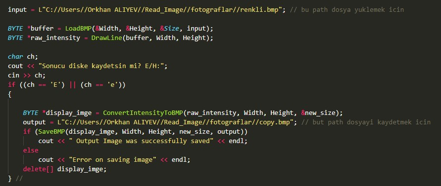
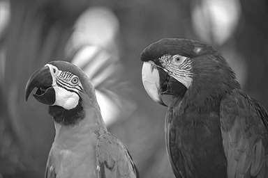

<h1>Görüntü işleme yaparak renkli bir görüntüyü griye dönüştürüp çizgi çizdirmek</h1>

<h2>Aşamalar</h2>

<b>
<ul>
<li>
Fotoğrafı konsol uygulamasına yükle
</li>
<li>
".bmp" uzantılı dosyayı yoğunluğa çevir(.bmp uzantılı dosyayı piksellere ayırarak tampona(buffer) kaydet)
</li>
<li>
Fotoğrafı griye çevirip çizgi çizdir
</li>
<li>
Dosyayı diske kaydet
</li>
</ul>

</b>

<h3>Aşamaların uygulanması sonucu fotoğrafta olan değişim</h3>

<ol>
<li>
 

</li>
<li>
 

</li>
<li>
 

</li>
</ol>

